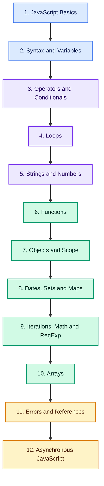

# JavaScript Roadmap: From Beginner to Advanced JS Developer

> A structured roadmap to learn JavaScript from fundamentals to advanced asynchronous programming.

## Quick Roadmap

**Foundations:** [JavaScript Basics](#javascript-basics) • [Syntax](#syntax) • [Variables](#variables) • [Operators](#operators) • [Conditionals](#conditionals) • [Loops](#loops)

**Core Language:** [Strings](#strings) • [Numbers](#numbers) • [Functions](#functions) • [Objects](#objects) • [Scope](#scope) • [Arrays](#arrays)

**Built-in Structures:** [Dates](#dates) • [Sets](#sets) • [Maps](#maps) • [Iterations](#iterations) • [Math](#math) • [Regular Expressions](#regular-expressions)

**Robustness:** [Errors](#errors) • [References](#references)

**Advanced:** [Asynchronous JavaScript](#asynchronous-javascript)

**Career Path:** [Interview Preparation](INTERVIEWS.md) • [Contributing Guide](CONTRIBUTING.md)

## Why Learn JavaScript?

JavaScript runs the web — every browser, most backends via Node.js, and a growing share of mobile and desktop apps. Learning it properly means going beyond syntax to understand scope, closures, prototypes, and asynchronous behavior, which is exactly what separates developers who can debug real production code from those who can only copy snippets.

## Build Job-Ready JavaScript Skills

Go beyond theory and learn how to:

- Write clean JS: syntax, variables (`let`/`const`), data types, operators, conditionals, loops
- Work confidently with core data structures: strings, numbers, arrays, objects, Sets, Maps
- Understand scope, hoisting, and strict mode
- Write and use functions, arrow functions, and function expressions correctly
- Use iterators, generators, and the Math and Date objects
- Write and debug regular expressions
- Handle errors gracefully and debug JS effectively
- Master asynchronous JavaScript: timeouts, callbacks, promises, async/await
- Build portfolio projects and prepare for interviews

> **Learn the syntax. Master the async model. Build real projects.**

Follow the roadmap in order, starting with JavaScript basics before moving into core language features, built-in data structures, error handling, and asynchronous programming.

## Complete Learning Path

### JavaScript Basics

- [Roadmap](https://dev.tech.examadda.org/javascript/roadmap)
- [Introduction](https://dev.tech.examadda.org/javascript/javascript-introduction)
- [Where To Execute JavaScript](https://dev.tech.examadda.org/javascript/where-to-execute-javascript)
- [Output](https://dev.tech.examadda.org/javascript/javascript-output)

---

### Syntax

- [Syntax in JavaScript](https://dev.tech.examadda.org/javascript/syntax-in-javascript)
- [Comments](https://dev.tech.examadda.org/javascript/javascript-comments)

---

### Variables

- [Introduction to Variables](https://dev.tech.examadda.org/javascript/variables-in-javascript)
- [Let](https://dev.tech.examadda.org/javascript/let-keyword-in-javascript)
- [Const](https://dev.tech.examadda.org/javascript/const-keyword-in-javascript)
- [Types](https://dev.tech.examadda.org/javascript/javascript-data-types)

---

### Operators

- [Introduction to Operators](https://dev.tech.examadda.org/javascript/javascript-operators-guide)
- [Arithmetic Operators](https://dev.tech.examadda.org/javascript/arithmetic-operators-in-javascript)
- [Assignment Operators](https://dev.tech.examadda.org/javascript/assignment-operators-in-javascript)
- [Comparison Operators](https://dev.tech.examadda.org/javascript/comparison-operators-in-javascript)
- [Logical Operators](https://dev.tech.examadda.org/javascript/logical-operators-in-javascript)

---

### Conditionals

- [Conditionals in JavaScript](https://dev.tech.examadda.org/javascript/mastering-conditionals-in-javascript)
- [If](https://dev.tech.examadda.org/javascript/javascript-if-statement)
- [If Else](https://dev.tech.examadda.org/javascript/javascript-if-else-statement)
- [Ternary](https://dev.tech.examadda.org/javascript/javascript-ternary-operator)
- [Switch](https://dev.tech.examadda.org/javascript/javascript-switch-statement)
- [Booleans](https://dev.tech.examadda.org/javascript/javascript-booleans)
- [Logical](https://dev.tech.examadda.org/javascript/javascript-logical-operators)

---

### Loops

- [Introduction to Loops](https://dev.tech.examadda.org/javascript/javascript-loops-for-while-do-while)
- [Loop for](https://dev.tech.examadda.org/javascript/introduction-to-for-loop-in-javascript)
- [Loop while](https://dev.tech.examadda.org/javascript/while-loop-in-javascript-beginners-guide)
- [Break](https://dev.tech.examadda.org/javascript/break-statement-in-javascript)
- [Continue](https://dev.tech.examadda.org/javascript/continue-statement-in-javascript)

---

### Strings

- [Introduction to Strings](https://dev.tech.examadda.org/javascript/introduction-to-strings-in-javascript)
- [String Templates](https://dev.tech.examadda.org/javascript/javascript-string-templates-tutorial)
- [String Methods](https://dev.tech.examadda.org/javascript/javascript-string-methods-guide)
- [String Search](https://dev.tech.examadda.org/javascript/javascript-string-search-methods)
- [String Reference](https://dev.tech.examadda.org/javascript/javascript-string-reference)

---

### Numbers

- [Numbers in JavaScript](https://dev.tech.examadda.org/javascript/numbers-in-javascript-tutorial)
- [Number Methods](https://dev.tech.examadda.org/javascript/javascript-number-methods)
- [Number Properties](https://dev.tech.examadda.org/javascript/javascript-number-properties)
- [Number Reference](https://dev.tech.examadda.org/javascript/javascript-number-reference)
- [Bitwise](https://dev.tech.examadda.org/javascript/javascript-bitwis)
- [BigInt](https://dev.tech.examadda.org/javascript/javascript-bigint)

---

### Functions

- [Function Intro](https://dev.tech.examadda.org/javascript/javascript-functions-introduction)
- [Function Parameters](https://dev.tech.examadda.org/javascript/javascript-function-parameters-guide)
- [Function Expressions](https://dev.tech.examadda.org/javascript/function-expressions-in-javascript-beginner-friendly-guide-with-examples)
- [Function Arrows](https://dev.tech.examadda.org/javascript/arrow-functions-in-javascript-complete-beginner-guide-with-examples)

---

### Objects

- [Introduction to Objects](https://dev.tech.examadda.org/javascript/javascript-objects-tutorial)
- [Object Properties](https://dev.tech.examadda.org/javascript/javascript-object-properties-tutorial)
- [Object Methods](https://dev.tech.examadda.org/javascript/javascript-object-methods-tutorial)
- [Object Display](https://dev.tech.examadda.org/javascript/display-javascript-objects-tutorial)

---

### Scope

- [Introduction to Scope](https://dev.tech.examadda.org/javascript/introduction-to-scope-in-javascript)
- [Code Blocks](https://dev.tech.examadda.org/javascript/code-blocks-in-javascript)
- [Hoisting](https://dev.tech.examadda.org/javascript/hoisting-in-javascript)
- [Strict Mode](https://dev.tech.examadda.org/javascript/strict-mode-in-javascript)

---

### Dates

- [Introduction to Dates](https://dev.tech.examadda.org/javascript/introduction-to-dates-in-javascript)
- [Date Formats](https://dev.tech.examadda.org/javascript/javascript-date-formats-tutorial)
- [Date Get](https://dev.tech.examadda.org/javascript/javascript-date-get-methods)
- [Date Set](https://dev.tech.examadda.org/javascript/javascript-date-set-methods)
- [Date Methods](https://dev.tech.examadda.org/javascript/javascript-date-methods-tutorial)

---

### Sets

- [Introduction](https://dev.tech.examadda.org/javascript/javascript-sets-tutorial)
- [Set Methods](https://dev.tech.examadda.org/javascript/javascript-set-methods-tutorial)
- [Set Logic](https://dev.tech.examadda.org/javascript/javascript-set-logic-tutorial)
- [Set WeakSet](https://dev.tech.examadda.org/javascript/javascript-weakset-tutorial)
- [Set Reference](https://dev.tech.examadda.org/javascript/javascript-set-reference)

---

### Maps

- [Introduction to Maps](https://dev.tech.examadda.org/javascript/javascript-maps-tutorial)
- [Map Methods](https://dev.tech.examadda.org/javascript/javascript-map-methods)
- [Map WeakMap](https://dev.tech.examadda.org/javascript/javascript-weakmap)
- [Map Reference](https://dev.tech.examadda.org/javascript/javascript-map-reference)

---

### Iterations

- [Iteration with Loops](https://dev.tech.examadda.org/javascript/javascript-loops-tutorial)
- [Iterables](https://dev.tech.examadda.org/javascript/iterables-in-javascript)
- [Iterators](https://dev.tech.examadda.org/javascript/javascript-iterators)
- [Generators](https://dev.tech.examadda.org/javascript/javascript-generators-tutorial)

---

### Math

- [Math in JavaScript](https://dev.tech.examadda.org/javascript/javascript-math-object)
- [Math Reference](https://dev.tech.examadda.org/javascript/javascript-math-reference)
- [Math Random](https://dev.tech.examadda.org/javascript/math-random-in-javascript)

---

### Regular Expressions

- [RegExp](https://dev.tech.examadda.org/javascript/regexp-in-javascript)
- [RegExp Flags](https://dev.tech.examadda.org/javascript/regexp-flags-in-javascript)
- [RegExp Classes](https://dev.tech.examadda.org/javascript/regexp-character-classes-in-javascript)
- [RegExp Metachars](https://dev.tech.examadda.org/javascript/regexp-metacharacters-in-javascript)
- [RegExp Assertions](https://dev.tech.examadda.org/javascript/regexp-assertions-in-javascript)
- [RegExp Quantifiers](https://dev.tech.examadda.org/javascript/regexp-quantifiers-in-javascript)
- [RegExp Patterns](https://dev.tech.examadda.org/javascript/regexp-patterns-in-javascript)
- [RegExp Objects](https://dev.tech.examadda.org/javascript/regexp-objects-in-javascript)
- [RegExp Methods](https://dev.tech.examadda.org/javascript/regexp-methods-in-javascript)

---

### Arrays

- [Introduction to Arrays](https://dev.tech.examadda.org/javascript/arrays-in-javascript)
- [Array Methods](https://dev.tech.examadda.org/javascript/array-methods-in-javascript)
- [Array Search](https://dev.tech.examadda.org/javascript/array-search-methods-in-javascript)
- [Array Sort](https://dev.tech.examadda.org/javascript/array-sort-in-javascript)
- [Array Iterations](https://dev.tech.examadda.org/javascript/array-iteration-methods-in-javascript)
- [Array Reference](https://dev.tech.examadda.org/javascript/javascript-array-reference)
- [Array Const](https://dev.tech.examadda.org/javascript/javascript-const-with-arrays)

---

### Errors

- [Intro](https://dev.tech.examadda.org/javascript/javascript-errors-introduction)
- [Silents](https://dev.tech.examadda.org/javascript/silent-errors-in-javascript)
- [Statements](https://dev.tech.examadda.org/javascript/javascript-error-statements)
- [Objects](https://dev.tech.examadda.org/javascript/javascript-error-objects)
- [Debugging](https://dev.tech.examadda.org/javascript/javascript-debugging)

---

### References

- [Keywords Reference](https://dev.tech.examadda.org/javascript/javascript-keywords-reference)
- [Keywords Reserved](https://dev.tech.examadda.org/javascript/javascript-reserved-keywords)
- [Operator Reference](https://dev.tech.examadda.org/javascript/javascript-operator-reference)
- [Operator Precedence](https://dev.tech.examadda.org/javascript/javascript-operator-precedence)

---

## 🚀 Advanced JavaScript

### Asynchronous JavaScript

- [Async Intro](https://dev.tech.examadda.org/javascript/introduction-to-asynchronous-javascript)
- [Async Timeouts](https://dev.tech.examadda.org/javascript/async-timeouts-in-javascript)
- [Async Callbacks](https://dev.tech.examadda.org/javascript/async-callbacks-in-javascript)
- [Async Promises](https://dev.tech.examadda.org/javascript/async-promises-in-javascript)
- [Async Await](https://dev.tech.examadda.org/javascript/async-await-in-javascript)

---

## Portfolio Projects

Build practical projects that demonstrate real-world JavaScript skills.

| Level | Project | Core Skills | Deliverables |
|:---:|---|---|---|
| 🟢 Beginner | Interactive To-Do List | DOM basics, arrays, functions, events | HTML/JS app, README |
| 🟢 Beginner | Form Validator | Regex, conditionals, error handling | Working validator, test cases |
| 🟡 Intermediate | Weather Dashboard | Fetch API, promises, async/await | Working app, API integration notes |
| 🟡 Intermediate | Data Table with Sets/Maps | Sets, Maps, array methods, iteration | Interactive data view |
| 🟠 Advanced | Debounced Search with Async Queue | Closures, promises, async control flow | Deployed demo, write-up |

## Interview Preparation

Prepare for JavaScript interviews with level-based questions and practical scenarios.

| Level | Resource |
|:---:|---|
| 🟢 Beginner | [Beginner JavaScript Interview Questions](https://dev.tech.examadda.org/javascript/beginner-interview-questions) |
| 🟡 Intermediate | [Intermediate JavaScript Interview Questions](https://dev.tech.examadda.org/javascript/intermediate-interview-questions) |
| 🔴 Advanced | [Advanced JavaScript Interview Questions](https://dev.tech.examadda.org/javascript/advanced-interview-questions) |

For structured preparation, follow the complete [JavaScript Interview Preparation Guide](INTERVIEWS.md).

Focus on `let`/`const`/`var` and hoisting, closures and scope, the event loop, promises vs async/await, `this` binding, array/object methods, and common error-handling patterns.

## 12-Week Balanced Learning Plan

| Weeks | Learning Focus | Milestone |
|:---:|---|---|
| 1 | Basics, syntax, variables, data types | Small scripting exercises |
| 2 | Operators, conditionals, loops | Logic-based mini exercises |
| 3 | Strings and numbers | String/number utility functions |
| 4 | Functions, arrow functions, expressions | Reusable function library |
| 5 | Objects and scope (hoisting, strict mode) | OOP-style object exercises |
| 6 | Arrays and array methods | Array manipulation project |
| 7 | Dates, Sets, and Maps | Data-structure practice problems |
| 8 | Iterations, generators, Math, and RegExp | Regex-based validator |
| 9 | Errors and debugging | Robust error-handling module |
| 10 | Asynchronous JS: timeouts, callbacks, promises | Promise-based mini project |
| 11 | Async/await and real API integration | Weather/data dashboard project |
| 12 | Capstone and interview revision | Live demo, README, and case study |

> Complete each milestone as a documented GitHub project to build an interview-ready portfolio.

## Contributing

Corrections, explanations, test cases and implementations are welcome. Read [CONTRIBUTING.md](CONTRIBUTING.md) before opening a pull request.

## About ExamAdda

[ExamAdda](https://examadda.org) is an all-in-one platform for mastering DSA, system design, development skills, and coding interviews through structured courses, hands-on practice, company-wise questions, and mock interviews.

**Learn smarter. Practice consistently. Crack top tech interviews.**

[Start Learning](https://tech.examadda.org/) • [Explore Courses](https://tech.examadda.org/courses/) • [Unlock ExamAdda Premium](https://examadda.org/premium)

## License

This repository is available under the [MIT License](LICENSE).
