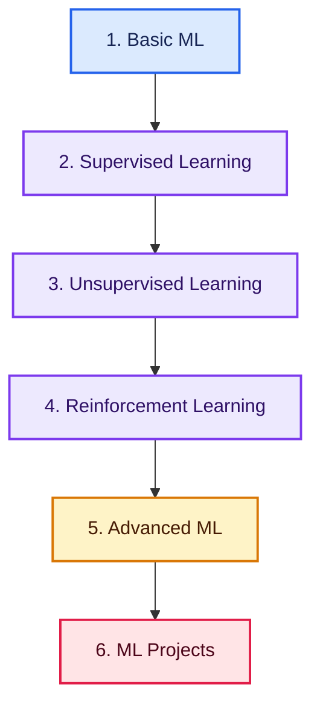

# Machine Learning Roadmap: From Beginner to Production-Ready ML Engineer

> A structured, project-based learning path covering ML fundamentals, supervised & unsupervised learning, reinforcement learning, advanced topics, and real-world projects

> 📚 Learn Machine Learning with the [ExamAdda Machine Learning Course](https://tech.examadda.org/machine-learning), covering fundamentals, core algorithms, advanced concepts, and projects.

**Learn → Practice → Build → Grow**

## Quick Roadmap

**Foundations:** [Basic ML](#01-basic-ml) • [Supervised Learning](#02-supervised-learning)

**Core Algorithms:** [Unsupervised Learning](#03-unsupervised-learning) • [Reinforcement Learning](#04-reinforcement-learning)

**Advanced & Applied:** [Advanced ML](#05-advanced-ml) • [ML Projects](#06-ml-projects)

**Career Path:** [Interview Preparation](INTERVIEWS.md) • [Contributing Guide](CONTRIBUTING.md)

## Why Learn Machine Learning?

Machine Learning underpins everything from recommendation engines to fraud detection to the models behind modern AI products. Learning it properly — not just calling `.fit()` — means understanding the math, the trade-offs between algorithms, and how to evaluate and ship models that actually work on real data.

## Build Job-Ready Machine Learning Skills

Go beyond theory and learn how to:

- Build and evaluate regression and classification models from first principles
- Choose the right algorithm: linear models, trees, ensembles (Random Forest, XGBoost, LightGBM, CatBoost), SVMs, KNN
- Apply unsupervised techniques: clustering, dimensionality reduction, association rule learning
- Understand reinforcement learning fundamentals: MDPs, Q-Learning, DQN, policy gradients
- Tackle advanced topics: time series forecasting, anomaly detection, recommendation systems, AutoML, federated learning
- Avoid overfitting/underfitting and pick the right evaluation metrics for the problem
- Build portfolio projects and prepare for interviews

> **Learn the concepts. Build real projects. Become production-ready.**

Follow the roadmap in order, starting with ML fundamentals before moving into supervised learning, unsupervised learning, reinforcement learning, advanced topics, and projects.

## Complete Learning Path

### 01. Basic ML

- [Foundations of ML](https://tech.examadda.org/machine-learning/artificial-intelligence-vs-machine-learning-vs-deep-learning-1)
- [Python for ML](https://tech.examadda.org/machine-learning/python-for-machine-learning)
- [SQL for Data & ML](https://tech.examadda.org/machine-learning/introduction-to-sql)
- [Mathematics for ML](https://tech.examadda.org/machine-learning/linear-algebra-for-machine-learning)
- ML Interview Questions
  - [Beginner](https://tech.examadda.org/machine-learning/beginner-interview-questions)
  - [Intermediate](https://tech.examadda.org/machine-learning/intermediate-interview-questions)
  - [Advanced](https://tech.examadda.org/machine-learning/advanced-interview-questions)

---

### 02. Supervised Learning

- Linear Regression

  - [Intuition behind regression](https://tech.examadda.org/machine-learning/intuition-behind-regression-in-machine-learning)
  - [Simple linear regression](https://tech.examadda.org/machine-learning/simple-linear-regression-in-machine-learning)
  - [Multiple linear regression](https://tech.examadda.org/machine-learning/multiple-linear-regression-in-machine-learning)
  - [Cost function](https://tech.examadda.org/machine-learning/cost-function-in-machine-learning)
  - [Gradient descent](https://tech.examadda.org/machine-learning/gradient-descent-in-machine-learning)
  - [Assumptions of linear regression](https://tech.examadda.org/machine-learning/assumptions-of-linear-regression)
  - [Overfitting & underfitting](https://tech.examadda.org/machine-learning/overfitting-and-underfitting-in-machine-learning)
  - [Evaluation Metrics](https://tech.examadda.org/machine-learning/evaluation-metrics-for-regression)
  - [Polynomial regression](https://tech.examadda.org/machine-learning/polynomial-regression-in-machine-learning)
  - [Regularization](https://tech.examadda.org/machine-learning/regularization-in-machine-learning)

- Logistic Regression

  - [Logistic Regression](https://tech.examadda.org/machine-learning/introduction-to-classification-in-machine-learning)
  - [Sigmoid function](https://tech.examadda.org/machine-learning/sigmoid-function-in-machine-learning)
  - [Logistic regression intuition](https://tech.examadda.org/machine-learning/logistic-regression-intuition)
  - [Cross entropy loss](https://tech.examadda.org/machine-learning/cross-entropy-loss-in-machine-learning)
  - [Confusion matrix](https://tech.examadda.org/machine-learning/confusion-matrix-in-machine-learning)
  - [Precision, Recall, F1-score](https://tech.examadda.org/machine-learning/precision-recall-and-f1-score-in-machine-learning)
  - [ROC-AUC](https://tech.examadda.org/machine-learning/roc-curve-and-auc-score-machine-learning)

- K-Nearest Neighbors

  - [KNN intuition](https://tech.examadda.org/machine-learning/knn-intuition-machine-learning)
  - [Distance metrics](https://tech.examadda.org/machine-learning/distance-metrics-in-machine-learning)
  - [Choosing K](https://tech.examadda.org/machine-learning/choosing-k-in-knn)
  - [Curse of dimensionality](https://tech.examadda.org/machine-learning/curse-of-dimensionality-machine-learning)

- Decision Trees

  - [Entropy](https://tech.examadda.org/machine-learning/entropy-in-machine-learning)
  - [Information gain](https://tech.examadda.org/machine-learning/information-gain-in-machine-learning)
  - [Gini index](https://tech.examadda.org/machine-learning/gini-index-in-machine-learning)
  - [Tree pruning](https://tech.examadda.org/machine-learning/tree-pruning-in-machine-learning)
  - [Decision Tree Algorithm](https://tech.examadda.org/machine-learning/decision-tree-algorithm-in-machine-learning)

- Ensemble Learning

  - [What is ensemble learning?](https://tech.examadda.org/machine-learning/what-is-ensemble-learning)
  - [Bagging](https://tech.examadda.org/machine-learning/bagging-in-machine-learning)
  - [Random Forest](https://tech.examadda.org/machine-learning/random-forest-in-machine-learning)
  - [Boosting intuition](https://tech.examadda.org/machine-learning/boosting-intuition-machine-learning)
  - [AdaBoost](https://tech.examadda.org/machine-learning/adaboost-in-machine-learning)
  - [Gradient Boosting](https://tech.examadda.org/machine-learning/gradient-boosting-in-machine-learning)
  - [XGBoost](https://tech.examadda.org/machine-learning/xgboost-in-machine-learning)
  - [LightGBM](https://tech.examadda.org/machine-learning/lightgbm-in-machine-learning)
  - [CatBoost](https://tech.examadda.org/machine-learning/catboost-in-machine-learning)
  - [Feature importance in ensembles](https://tech.examadda.org/machine-learning/feature-importance-in-ensemble-models)

- Support Vector Machines

  - [Hyperplanes](https://tech.examadda.org/machine-learning/hyperplanes-in-machine-learning)
  - [Margins](https://tech.examadda.org/machine-learning/margins-in-support-vector-machines)
  - [Kernel trick](https://tech.examadda.org/machine-learning/kernel-trick-in-svm)
  - [Linear vs non-linear SVM](https://tech.examadda.org/machine-learning/linear-vs-nonlinear-svm)

---

### 03. Unsupervised Learning

- Clustering

  - [What is clustering?](https://tech.examadda.org/machine-learning/what-is-clustering-in-machine-learning)
  - [K-Means](https://tech.examadda.org/machine-learning/k-means-clustering-in-machine-learning)
  - [Elbow method](https://tech.examadda.org/machine-learning/elbow-method-in-kmeans-clustering)
  - [Hierarchical clustering](https://tech.examadda.org/machine-learning/hierarchical-clustering-in-machine-learning)
  - [Gaussian Mixture Models](https://tech.examadda.org/machine-learning/gaussian-mixture-models-in-machine-learning)

- Dimensionality Reduction

  - [Curse of dimensionality](https://tech.examadda.org/machine-learning/curse-of-dimensionality-machine-learning-1)
  - [PCA intuition](https://tech.examadda.org/machine-learning/pca-intuition-machine-learning)
  - [t-SNE](https://tech.examadda.org/machine-learning/tsne-machine-learning)
  - [UMAP](https://tech.examadda.org/machine-learning/umap-machine-learning)
  - [Feature selection methods](https://tech.examadda.org/machine-learning/feature-selection-methods-machine-learning)

- Association Rule Learning

  - [Apriori algorithm](https://tech.examadda.org/machine-learning/apriori-algorithm-machine-learning)
  - [Market basket analysis](https://tech.examadda.org/machine-learning/market-basket-analysis-machine-learning)

---

### 04. Reinforcement Learning

- [RL Fundamentals](https://tech.examadda.org/machine-learning/what-is-reinforcement-learning)
- [Agent–Environment Interaction](https://tech.examadda.org/machine-learning/agent-environment-interaction-reinforcement-learning)
- [Rewards & Policies](https://tech.examadda.org/machine-learning/rewards-and-policies-in-reinforcement-learning)
- [Markov Decision Processes](https://tech.examadda.org/machine-learning/markov-decision-process-reinforcement-learning)
- [Q-Learning](https://tech.examadda.org/machine-learning/q-learning-reinforcement-learning)
- [Deep Q-Networks](https://tech.examadda.org/machine-learning/deep-q-networks-dqn-reinforcement-learning)
- [Policy Gradient Methods](https://tech.examadda.org/machine-learning/policy-gradient-methods-reinforcement-learning)

---

### 05. Advanced ML

- [Time Series Forecasting](https://tech.examadda.org/machine-learning/time-series-forecasting-machine-learning)
- [Anomaly Detection](https://tech.examadda.org/machine-learning/anomaly-detection-machine-learning)
- [Recommendation Systems](https://tech.examadda.org/machine-learning/recommendation-systems-machine-learning)
- [Federated Learning](https://tech.examadda.org/machine-learning/federated-learning-machine-learning)
- [AutoML](https://tech.examadda.org/machine-learning/automl-automated-machine-learning)

---

### 06. ML Projects

- [Beginner Project](https://tech.examadda.org/machine-learning/beginner-project)
- [Intermediate Project](https://tech.examadda.org/machine-learning/intermediate-project)
- [Advanced Project](https://tech.examadda.org/machine-learning/advanced-project)

---

## Portfolio Projects

Build practical projects that demonstrate real-world Machine Learning skills.

| Level | Project | Core Skills | Deliverables |
|:---:|---|---|---|
| 🟢 Beginner | Regression/Classification Baseline | Linear/logistic regression, evaluation metrics | Notebook, README, metrics report |
| 🟡 Intermediate | Ensemble Model on Real Dataset | Random Forest, XGBoost/LightGBM, feature importance | Trained model, comparison report |
| 🟠 Advanced | End-to-End ML Pipeline | Clustering/dimensionality reduction, tuning, deployment | Deployed model, evaluation write-up |

## Interview Preparation

Prepare for Machine Learning interviews with level-based questions.

| Level | Resource |
|:---:|---|
| 🟢 Beginner | [Beginner ML Interview Questions](https://tech.examadda.org/machine-learning/beginner-interview-questions) |
| 🟡 Intermediate | [Intermediate ML Interview Questions](https://tech.examadda.org/machine-learning/intermediate-interview-questions) |
| 🔴 Advanced | [Advanced ML Interview Questions](https://tech.examadda.org/machine-learning/advanced-interview-questions) |

For structured preparation, follow the complete [ML Interview Preparation Guide](INTERVIEWS.md).

Focus on bias-variance trade-off, choosing the right algorithm and evaluation metric for the problem, regularization, handling imbalanced data, feature engineering, and explaining model decisions clearly.

## 16-Week Balanced Learning Plan

| Weeks | Learning Focus | Milestone |
|:---:|---|---|
| 1–2 | ML foundations, Python/SQL for ML, math for ML | Environment setup + data exploration notebook |
| 3–5 | Linear & logistic regression, evaluation metrics | Regression + classification baseline models |
| 6–7 | KNN, decision trees | Tree-based classifier from scratch |
| 8–9 | Ensemble learning (Random Forest, XGBoost, LightGBM, CatBoost) | Ensemble model comparison |
| 10 | Support Vector Machines | SVM on a real dataset |
| 11–12 | Unsupervised learning: clustering, dimensionality reduction, association rules | Clustering + PCA analysis project |
| 13 | Reinforcement learning fundamentals through Q-Learning/DQN | Simple RL agent (grid world or similar) |
| 14 | Advanced ML: time series, anomaly detection, recommendation systems | Advanced-topic mini project |
| 15 | AutoML & federated learning overview + portfolio project work | Intermediate/advanced project draft |
| 16 | Capstone and interview revision | Live demo, README, and case study |

> Complete each milestone as a documented GitHub project to build an interview-ready portfolio.

## Contributing

Corrections, explanations, test cases and implementations are welcome. Read [CONTRIBUTING.md](CONTRIBUTING.md) before opening a pull request.

## About ExamAdda

[ExamAdda](https://examadda.org) is an all-in-one platform for mastering DSA, system design, development skills, and coding interviews through structured courses, hands-on practice, company-wise questions, and mock interviews.

**Learn smarter. Practice consistently. Crack top tech interviews.**

[Start Learning](https://tech.examadda.org/) • [Explore Courses](https://tech.examadda.org/courses/) • [Unlock ExamAdda Premium](https://examadda.org/premium)

## License

This repository is available under the [MIT License](LICENSE).
